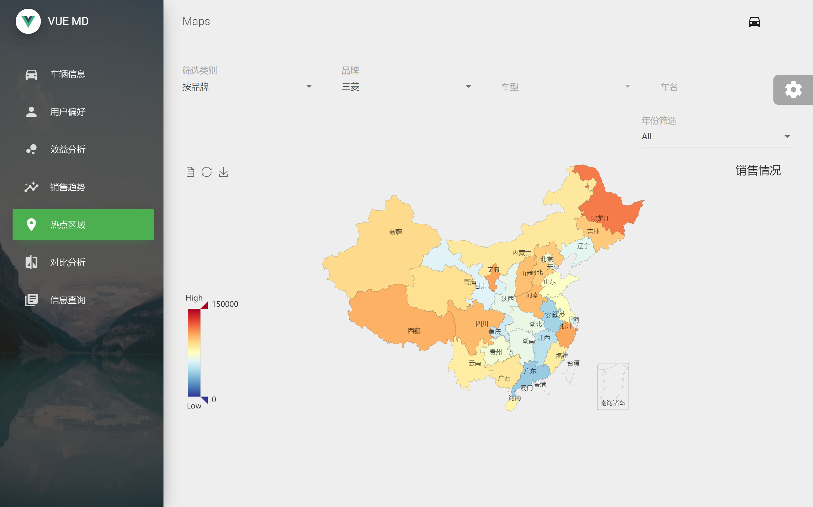

## CQU - 实训项目





---


## 部署说明


### 前期准备

#### 获取代码

- 方案一：

  解压代码包压缩文件

- 方案二：

  `git clone https://github.com/HonokiaHT/carBigDataPlatform.git `

  

#### 环境配置

[Node.js](https://nodejs.org/en/)

建议使用 LTS 版本


### 部署本项目

部署过程示例：

```shell
git clone https://github.com/HonokiaHT/carBigDataPlatform.git
cd carBigDataPlatform

# 安装依赖
npm install
```


确保安装依赖过程中没有发生错误后：

```shell
npm run serve
```


等待加载完毕后，访问 `http://localhost:8080/` 即可。


---


### 附：图表添加方法

1. 使用 **`npm i v-charts echarts@4.9.0 -S`** 来安装 vcharts 以及 echarts，且使用低版本 echarts 来避免不适配。

2. 按 v-charts 文档在 `main.js` 中引入

   ```js
   import VCharts from "v-charts";
   Vue.use(VCharts);
   ```

3. （可略）在 src 目录下新建 **`declaration.d.ts`** 文件，内容为 `declare module "v-charts";` 

4. 在将要添加图表的 .vue 文件中，`import` 所需的具体图表。

   如：使用折线图，即 `import VeLine from 'v-charts/lib/line.common';`

5. 在 .vue 文件中相应位置添加图表标签，并绑定 `data` 等属性即可。

   如：

   ```vue
   <ve-line  :data="sales_line_chart.data" :title="sales_line_chart.title"></ve-line>
   
   
   data() {
       return {
         sales_line_chart:{
           data: {
             columns: ["年份", "销售量", "价格"],
             rows: [
               { 年份: "2017年", 销售量: 123, 价格: 193 },
               { 年份: "2018年", 销售量: 1223, 价格: 1223 },
               { 年份: "2019年", 销售量: 2123, 价格: 1223 },
               { 年份: "2020年", 销售量: 4123, 价格: 1236 },
               { 年份: "2021年", 销售量: 3123, 价格: 123 },
             ]
           },
   
           title: {
             text: "销售情况",
           },
         },
       },
     },
   ```

   

